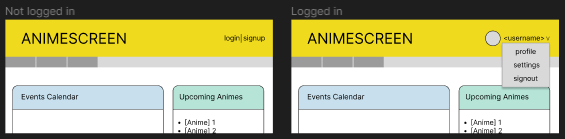
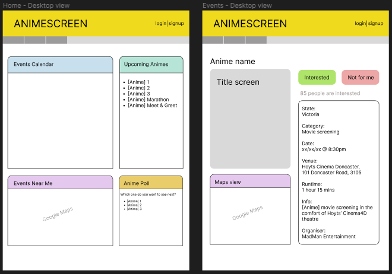
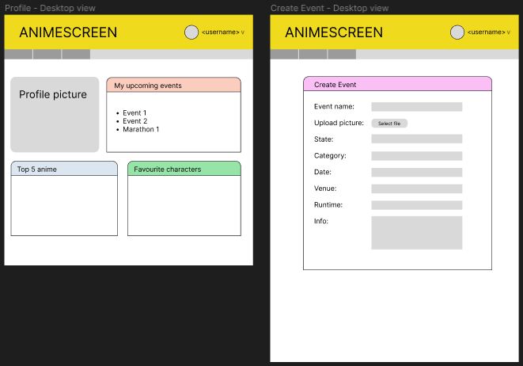
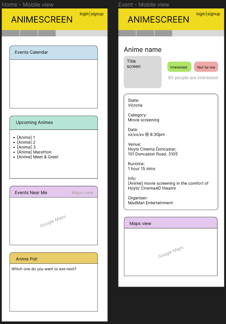
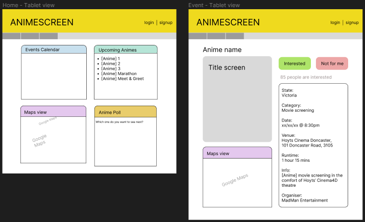
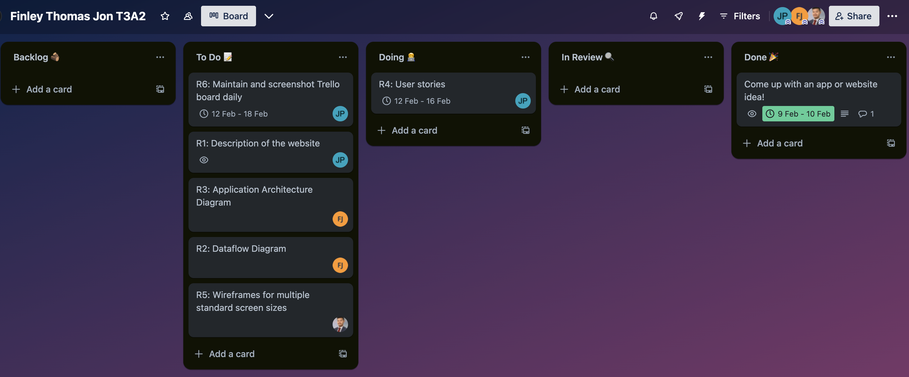

# T3A2-A Anime Event and Screening Scheduler

## Description

### Purpose

The purpose of our app and website is to provide a comprehensive platform for both anime enthusiasts and Madman Entertainment, an Australian distribution and rights management company, to discover, engage with and organise anime-related events. Our platform is designed to facilitate anime screenings, streamline event organisation and enhance engagement within the anime community.

### Functionality / Features

- **User authentication:** Login and registration system where users can create accounts and access the platform.
- **Organiser accounts:** Flag certain user accounts as organisers, granting them privileges to create and manage event listings.
- **Event listings:** Provides a list of upcoming anime events and screenings, including details such as date, time, location, and a description.
- **Event calendar:** Users can view events displayed on a calendar, making it easier to plan their schedules.
- **Event RSVP:** Allows users to RSVP to events they are interested in attending, providing organisers with insights into the attendance.
- **Searching and filtering:** Allows users to easily find events based on criteria such as anime title, location and dates.
- **Map integration:** Integrates maps to display event locations, helping users to navigate and find venues easily.

### Target Audience

- **Anime fans and interested individuals:** The app caters to those who have an interest in anime culture and includes the most dedicated enthusiasts to those who are simply wanting to know more about anime. It is intended for fans across any genre, series or character. 

- **Madman Entertainment and event organisers:** The app is intended for the client, as well as other verified organisers, to promote, advertise and garner interest in anime-related events, such as screenings, film festivals, marathons, meet-ups and conventions.  

### Tech Stack

- **Database:** [MongoDB](https://www.mongodb.com/) 
- **Backend:** [Express](https://expressjs.com/) and [Node.js](https://nodejs.org/) 
- **Frontend:** [React](https://react.dev/) 
- **Object Data Modeling (ODM) library:** [Mongoose](https://mongoosejs.com/) 
- **Project management:** [Trello](https://trello.com/) 
- **Wireframes:** [Figma](https://www.figma.com/) 
- **Collaboration/communication:** [Discord](https://discord.com/) 

## Data Flow Diagram

### Overview 

### Login/Registration

The user will be able to access the platform logging in with their username and password. If the user does not have an account, they can register and create a new account. 

Organisers can access the platform by logging in with their username and password. If the organiser does not have an account, they can register and create a new account. The account will need to be flagged as an organiser by an admin.

### Profile Picture Upload

The user will be able to upload a profile picture to their account by selecting an image file from their device. The image image will be uploaded to the AWS storage and a URL will be sent back to then be stored in the user's account in the users collection in the database.

## Application Architecture Diagram

## User Stories

- As a user, I want to create an account on the platform, so that I can access upcoming anime events and screenings.
- As a user, I want to be able to log out of my account, so that my account is protected when I am not longer using it.
- As a user, I want to upload a picture to my profile, so that I can customise my profile.
- As a user, I want to add my top 5 favourite animes, so that I can customise my profile.
- As a user, I want to add my favourite characters, so that I can customise my profile.
- As an event organiser, I want to have privileges to create and manage event listings, so that I can effectively organise events.
- As an event organiser, I want to be able to add an event name, state, category, date, venue, information and upload a photo, so that I can provide event information for patrons for my created event.
- As a user, I want to view a list of upcoming events, so that I can find events that interest me.
- As a user, I want to view events on a calendar, so that I can plan my schedule more effectively.
- As a user, I want to RSVP to events I plan to attend, so that I can indicate my interest and help organisers gauge attendance.
- As a user, I want to easily search and filter events by criteria like anime title, location, and date, so that I can find events that match my preferences.
- As a user, I want event locations displayed on an embedded map, so that I can find venues easily.

## Wireframes
#### Not logged in vs. Logged in

#### Desktop view
Home and Events page

Profile and Create Events page

#### Mobile view
Home and Events page

Profile and Create Events page

#### Tablet view
Home and Events page

Profile and Create Events page

## Trello Board

#### 2024-02-12
