# T3A2-A Anime Event and Screening Scheduler

## Description

[Github Repository](https://github.com/finleyjepson/T3A2-A)

### Purpose

The purpose of our app and website is to provide a comprehensive platform for both anime enthusiasts and Madman Entertainment, an Australian distribution and rights management company, to discover, engage with and organise anime-related events. Our platform is designed to facilitate anime screenings, streamline event organisation and enhance engagement within the anime community.

### Functionality / Features

- **User authentication:** Login and registration system where users can create accounts and access the platform.
- **Organiser accounts:** Flag certain user accounts as organisers, granting them privileges to create and manage event listings.
- **Event listings:** Provides a list of upcoming anime events and screenings, including details such as date, time, location, and a description.
- **Event calendar:** Users can view events displayed on a calendar, making it easier to plan their schedules.
- **Event RSVP:** Allows users to RSVP to events they are interested in attending, providing organisers with insights into the attendance.
- **Searching and filtering:** Allows users to easily find events based on criteria such as anime title, location and dates.
- **Map integration:** Integrates maps to display event locations, helping users to navigate and find venues easily.

### Target Audience

- **Anime fans and interested individuals:** The app caters to those who have an interest in anime culture and includes the most dedicated enthusiasts to those who are simply wanting to know more about anime. It is intended for fans across any genre, series or character. 

- **Madman Entertainment and event organisers:** The app is intended for the client, as well as other verified organisers, to promote, advertise and garner interest in anime-related events, such as screenings, film festivals, marathons, meet-ups and conventions.  

### Tech Stack

- **Database:** [MongoDB](https://www.mongodb.com/) and [AWS](https://aws.amazon.com/)
- **Backend:** [Express](https://expressjs.com/) and [Node.js](https://nodejs.org/) 
- **Frontend:** [React](https://react.dev/) 
- **Object Data Modeling (ODM) library:** [Mongoose](https://mongoosejs.com/) 
- **Project management:** [Trello](https://trello.com/) 
- **Wireframes:** [Figma](https://www.figma.com/) 
- **Collaboration/communication:** [Discord](https://discord.com/) 

## Data Flow Diagram

### Legend

- **External Entity -** These are entities that interact with the system but are not part of the system, eg. users.
- **Process -** These are the processes that occur within the system, eg. user authentication.
- **Data Store -** These are the data stores that hold data within the system, eg. databases.

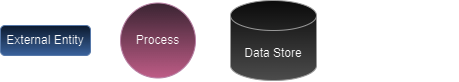

### Overview

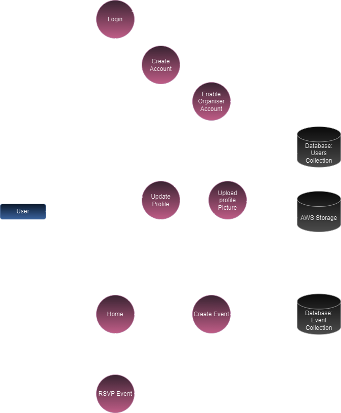

### Events

The user will be able to view a list of upcoming events and screenings. The events will be displayed in a list format and will include details such as the event name, date, time, location, and a description. The user will also be able to view events on a calendar, making it easier to plan their schedules. The user will be able to RSVP to events they are interested in attending, providing organisers with insights into the attendance. The user will also be able to easily search and filter events based on criteria such as anime title, location and dates. They will also be able to view event locations on an embedded map, helping them to navigate and find venues easily.

Organisers will be able to create and manage event listings. They will be able to add an event name, state, category, date, venue, information.

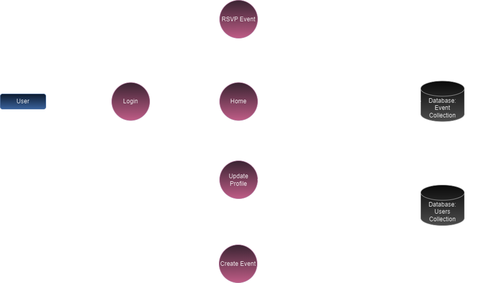

### Login/Registration

The user will be able to access the platform logging in with their username and password. If the user does not have an account, they can register and create a new account. 

Organisers can access the platform by logging in with their username and password. If the organiser does not have an account, they can register and create a new account. The account will need to be flagged as an organiser by an admin.

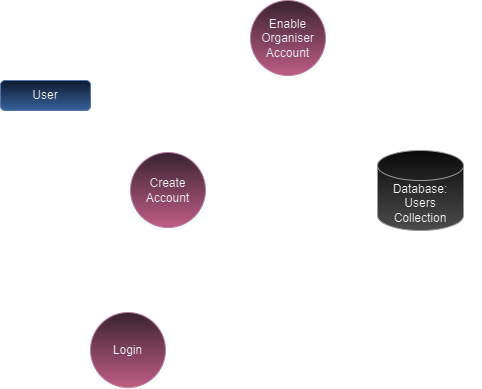

### Profile Picture Upload

The user will be able to upload a profile picture to their account by selecting an image file from their device. The image image will be uploaded to the AWS storage and a URL will be sent back to then be stored in the user's account in the users collection in the database.

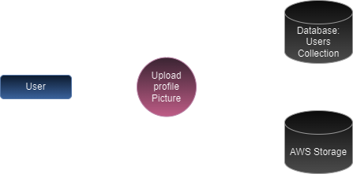

## Application Architecture Diagram

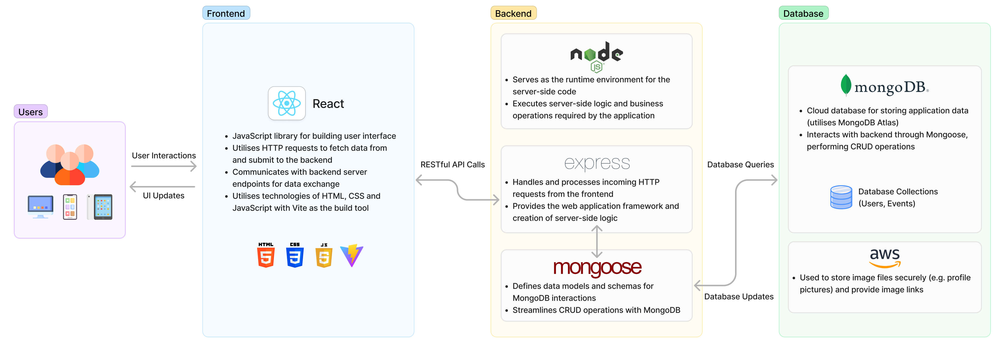

### Frontend

The Apps frontend is built using the React JavaScript library.
It is responsible for creating an interface for the user to interact with the application. It will be responsible for rendering the user interface, handling user input, and making requests to the backend server.

### Backend

The backend of the application is built using the Express framework for Node.js. It is responsible for handling requests from the frontend, interacting with the database, and returning responses to the frontend.

### Database

The database for the application is built using MongoDB & AWS. It is responsible for storing all the data for the application, including user accounts, event listings, and profile pictures(AWS). The database will be accessed by the backend server via the Mongoose ODM.

## User Stories
#### Written 14th February 2024
- As a user, I want to create an account on the platform, so that I can access upcoming anime events and screenings.
- As an event organiser, I want to have privileges to create and manage event listings, so that I can effectively organise events.
- As a user, I want to view a list of upcoming events, so that I can find events that interest me.
- As a user, I want to view events on a calendar, so that I can plan my schedule more effectively.
- As a user, I want to RSVP to events I plan to attend, so that I can indicate my interest and help organisers gauge attendance.
- As a user, I want to easily search and filter events by criteria like anime title, location, and date, so that I can find events that match my preferences.
- As a user, I want event locations displayed on an embedded map, so that I can find venues easily.

#### Revised and added on 15th February 2024
- As a user, I want to be able to log out of my account, so that my account is protected when I am not longer using it.
- As a user, I want to upload a picture to my profile, so that I can customise my profile.
- As a user, I want to add my top 5 favourite animes, so that I can customise my profile.
- As a user, I want to add my favourite characters, so that I can customise my profile.
- As an event organiser, I want to be able to add an event name, state, category, date, venue, information and upload a photo, so that I can provide event information for patrons for my created event.

## Wireframes
### Log in/sign up flow
- The first page a user will see is the home page which will contain a number of components that are not dependent on the user being logged in. From this page a user can choose to sign up or log in to an existing account.

- Upon signing up or logging in, a user will then have access to their profile screen and can make customisations such as adding in a profile picture, adding in their top 5 anime/characters as well as viewing any upcoming events they have RSVP'd to.

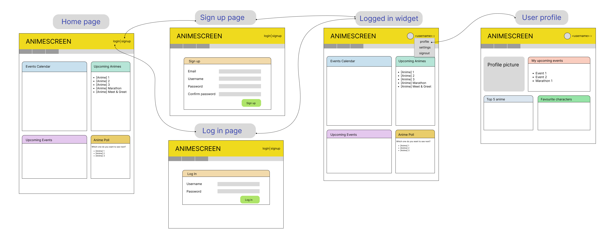

### App flow
- From the home page, users will be presented with a calendar widget showing the current month and any events that are scheduled will be highlighted within this calendar. Additionally, a list view of the upcoming events will be shown to the user.

- Clicking onto an event from the calender or upcoming events widget will take the user directly to the event information page where they can log their interest in the event by clicking 'Interested' or 'Not for me'.

- The navigation bar will have an 'All events' link which will take the user to the events landing page. This page will contain a list of all the events posted to the platform and will have filter options giving users the ability to find events that fit their criteria.

- Clicking onto any events on the event landing page will direct users to the event page where all the event information will be shown. Users can RSVP from this page.

- The navigation bar will have a 'Create event' link which will only be available to authorised users (i.e. users who have been flagged as 'Organisers' by the Admins) and will take the user to a form allowing them to create a new event listing or edit an existing listing if it already exists. Once the event is published it will appear on the platform and will be available for users to view.

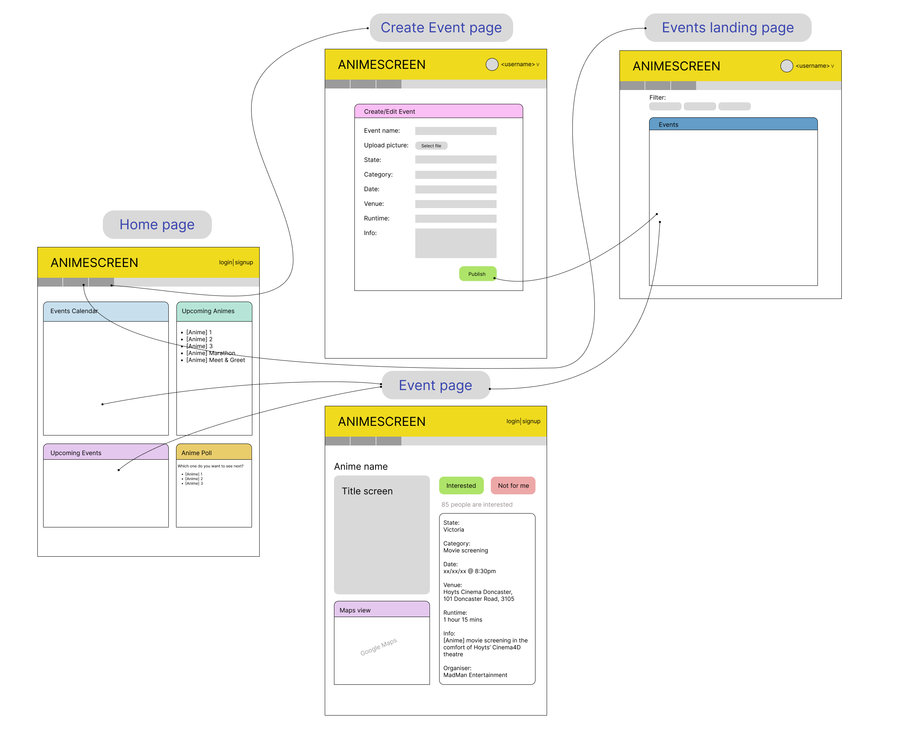

### Wireframes
- Login and sign up screens
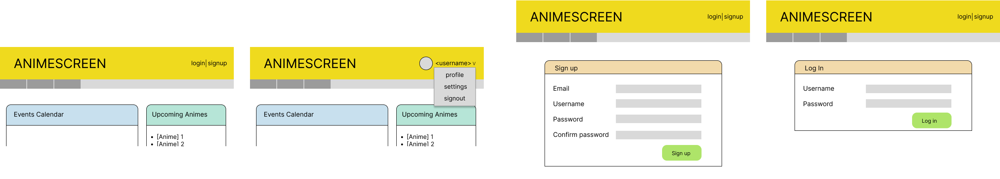

- Desktop view

- Mobile view

- Tablet view

## Trello Board

- 2024-02-12

- 2024-02-14
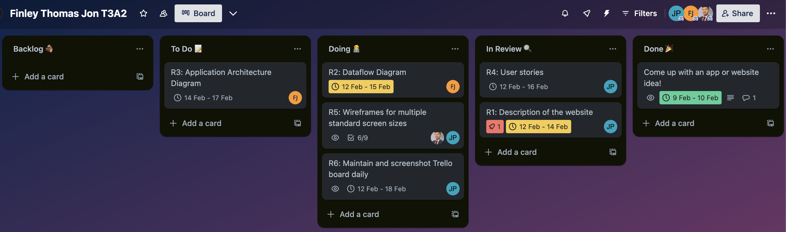

- 2024-02-15
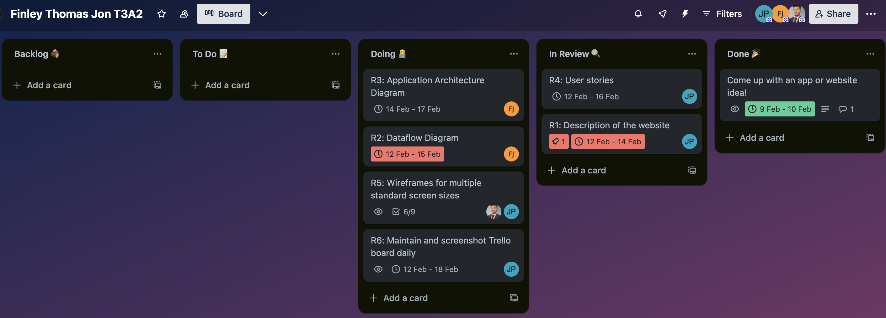

- 2024-02-16
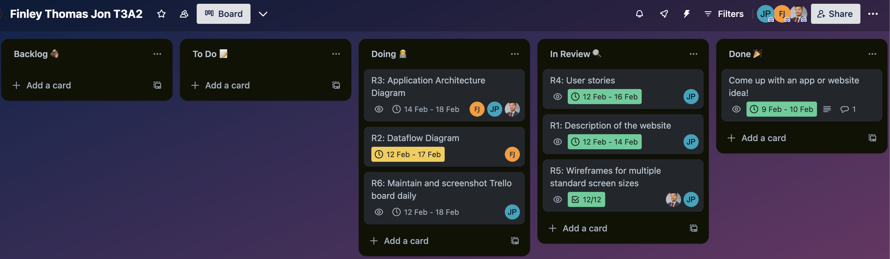

- 2024-02-17 (Morning)
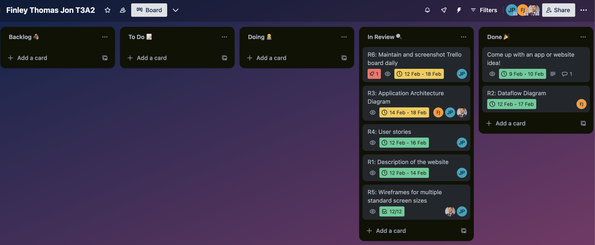

- 2024-02-17 (Evening)
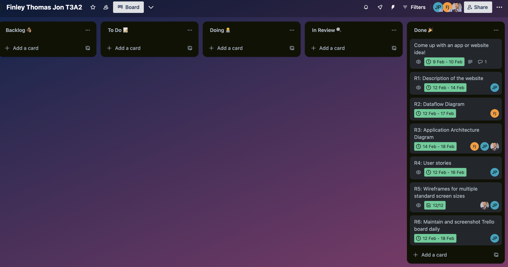

